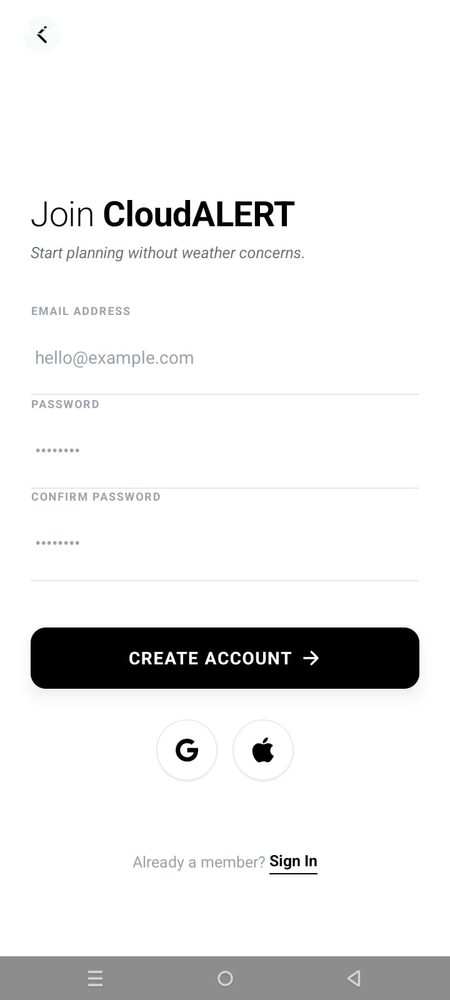
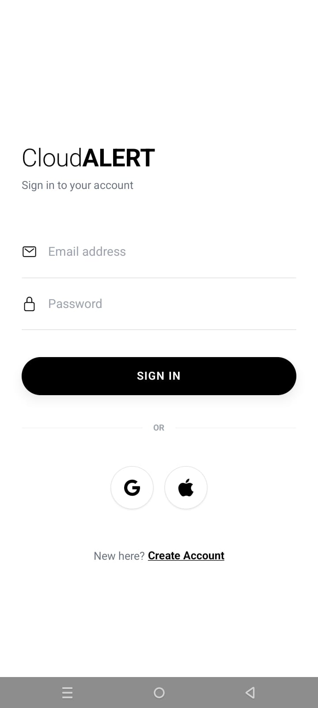
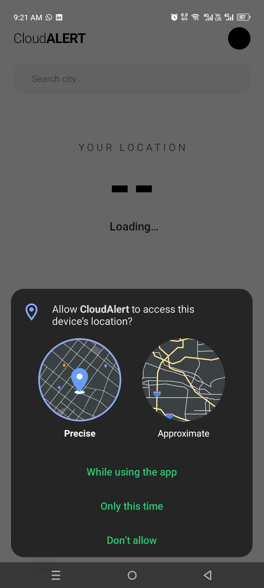
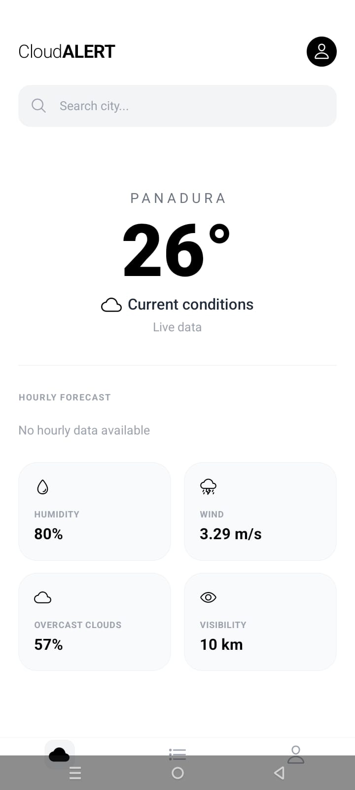
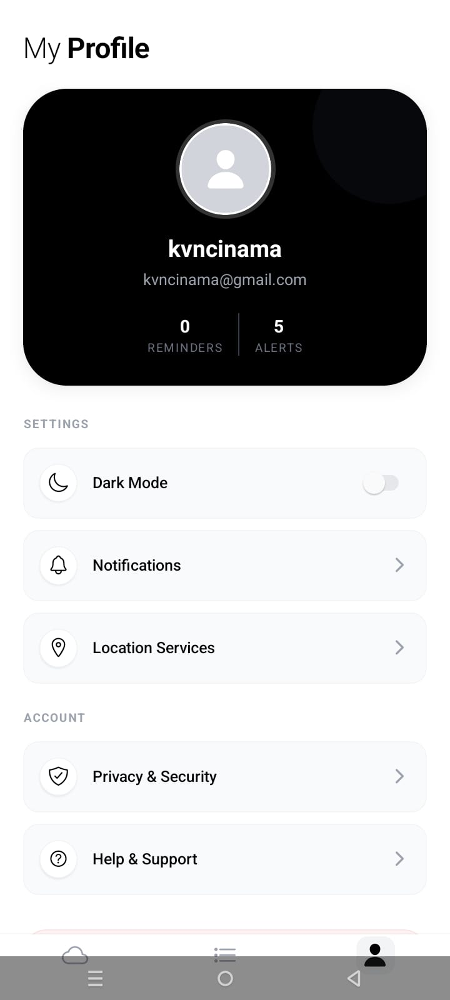

# 🌩️ Cloud ALERT

Cloud ALERT is a modern mobile application built using **React Native (Expo)** that helps users plan their day without weather worries.  
The application provides smart alerts, reminders, and a clean user interface designed with a black and white theme.

This project was developed for educational purposes as part of a university mobile development course.

---

## 📱 Features

- 🌦️ Weather-based alert system
- 🔔 Smart reminders with real-time updates
- ☁️ Clean and minimal black & white UI design
- 🔄 Real-time data sync using Firebase Firestore
- 📦 Swipe-to-delete and swipe-to-edit reminders
- 📲 Android APK build support via EAS

---

## 🛠️ Tech Stack

- **React Native**
- **Expo**
- **Expo Router**
- **Firebase Firestore**
- **NativeWind (Tailwind for React Native)**
- **EAS Build (for APK generation)**

---

## 📂 Project Structure

```
Cloud-Alert/
│
├── app/
│   ├── dashboard/
│   │   ├── index.tsx
│   │   ├── reminders.tsx
│   │   ├── profile.tsx
│   │
│   ├── splash/
│   │   └── SplashScreen.tsx
│   │
│   └── _layout.tsx
│
├── firebase/
│   └── config.ts
│
├── assets/
│   └── images/
│
├── app.json
├── eas.json
└── README.md
```

---

## 🔥 Firebase Configuration

1. Go to Firebase Console.
2. Create a new project.
3. Enable **Firestore Database**.
4. Copy your Firebase configuration.
5. Create a file:

```
firebase/config.ts
```

Example configuration:

```ts
import { initializeApp } from "firebase/app";
import { getFirestore } from "firebase/firestore";

const firebaseConfig = {
  apiKey: "YOUR_API_KEY",
  authDomain: "YOUR_AUTH_DOMAIN",
  projectId: "YOUR_PROJECT_ID",
  storageBucket: "YOUR_STORAGE_BUCKET",
  messagingSenderId: "YOUR_MESSAGING_ID",
  appId: "YOUR_APP_ID",
};

const app = initializeApp(firebaseConfig);
export const db = getFirestore(app);
```

---

## 🚀 Installation

Clone the repository:

```bash
git clone https://github.com/your-username/cloud-alert.git
cd cloud-alert
```

Install dependencies:

```bash
npm install
```

Start development server:

```bash
npx expo start
```

---

## 📦 Build Android APK

### 1️⃣ Configure EAS

```bash
eas build:configure
```

### 2️⃣ Update `eas.json`

Make sure your production profile includes:

```json
"production": {
  "autoIncrement": true,
  "android": {
    "buildType": "apk"
  }
}
```

### 3️⃣ Build APK

```bash
eas build -p android --profile production
```

## After the build finishes, download the APK from the generated link.

## 📲 Download APK

[](https://expo.dev/artifacts/eas/s9TpXL6oU978vmoYpxN3Vq.apk)

## 🔐 Permissions Used

This application may request the following permissions:

- 📍 Location
- 🌐 Internet (for Firebase connectivity)

All permissions are requested at runtime and follow Android security best practices.

---

## 🎓 Educational Purpose

This project demonstrates:

- Mobile app development using React Native
- Cloud database integration with Firebase
- Real-time data synchronization
- Android runtime permission handling
- Secure and ethical mobile development practices

---

## 📊 Learning Outcomes

Through this project, the following concepts were implemented:

- CRUD operations in Firestore
- Real-time listeners using `onSnapshot`
- Swipe gestures in React Native
- Modular architecture (separating logic from components)
- APK generation using EAS
- Android keystore and signing process

---

## 👨‍💻 Author

**Name:** Vihanga Nimsara  
**University:** IJSE  
**Course:** Mobile Application Development  
**Year:** 2026

---

## 📄 License

This project is developed for educational purposes only.

---

## ⭐ Future Improvements

- Dark mode support
- User authentication system
- Offline support

---

## 📸 Screenshots








